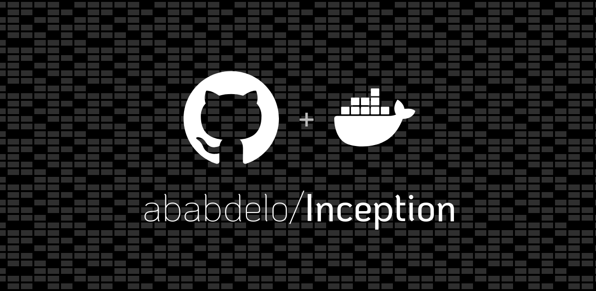
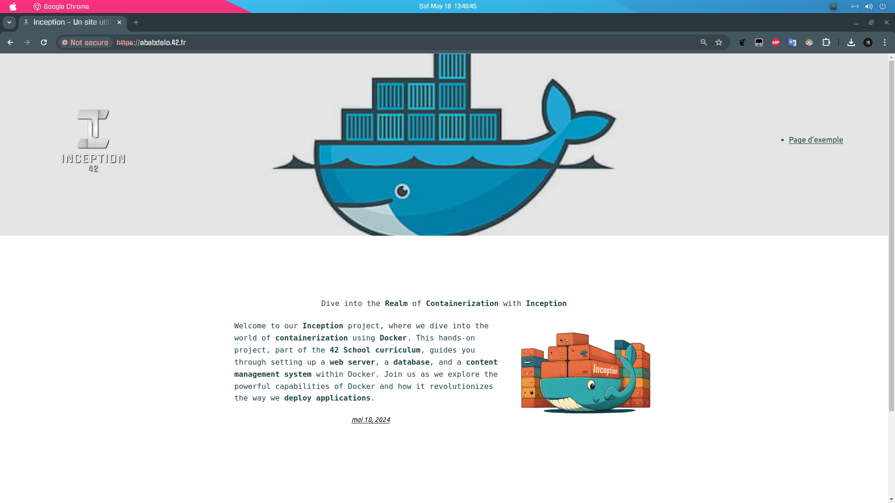

<h1 style="color:CornflowerBlue;"> Inception </h1> 
  

Dive into **System Administration** with **Docker**! This **Project** guides you through creating **Virtualized Environments** using Docker within a **Personal VM**, expanding your **knowledge** and **Practical Skills**.

Get hands-on with **Containerization**, building **Custom Images**, and managing **Applications** efficiently.

---

### Preview :

  

---

### First of all :

**Docker** is not a **Virtual Machine**. It is a **mechanism** to **Containerize Applications** and **Isolate the Processes** running these applications. **Docker** uses a feature in the **Kernel** called **NAMESPACES**.

A Linux namespace is a feature that the Linux kernel provides to isolate resources for a set of processes. This offers two main advantages:

1. **Isolation of resources**: One troublesome process won’t affect the entire host but only those processes within the same namespace.
2. **Security**: A security flaw in a process running under a specific namespace won’t give the attacker access to the whole system.

---

### Quick Overview of Namespaces :

- **User namespace**: Contains an independent set of user IDs and group IDs.
- **PID namespace**: Contains its own set of process IDs (PIDs). Each new namespace starts with PID 1.
- **Mount namespace**: Manages mount points independently.
- **Network namespace**: Virtualizes the network stack, including interfaces, IPs, route tables, and sockets.
- **IPC (Inter-Process Communication) namespace**: Defines shared memory segments for processes within a namespace.
- **UTS (Unix Time-Sharing) namespace**: Allows different host names and domain names for each namespace.
- **Time namespace**: Allows different system times within the system (introduced in 2020).
- **CGroup (Control Groups) namespace**: Limits resource usage (CPU, memory, disk, etc.) for a group of processes (introduced in 2016).

#### Note :
- Virtual machines isolate hardware, while Docker isolates processes.

---

###  Project Structure :

The project involves creating three containers, each based on a minimal OS image and configured manually:

- <h4>  Container </h4>

  - **Base Image**:  version: 11
  - **Packages Installed**: `nginx`, `openssl`
  - **Purpose**: To serve as a web server that handles HTTP requests and serves the WordPress application.

- <h4>  Container </h4>

  - **Base Image**:  version: 11
  - **Packages Installed**: `mariadb-server`
  - **Purpose**: To act as the database server for the WordPress application, storing all data in a relational database.

- <h4>  Container </h4>

  - **Base Image**:  version: 11
  - **Packages Installed**: `php`, `php-fpm`, `php-mysql`, `wordpress`
  - **Purpose**: To provide the application layer for the WordPress site, handling user interactions and managing content.

---

## License :

This project is licensed under the [MIT License](license.md).

